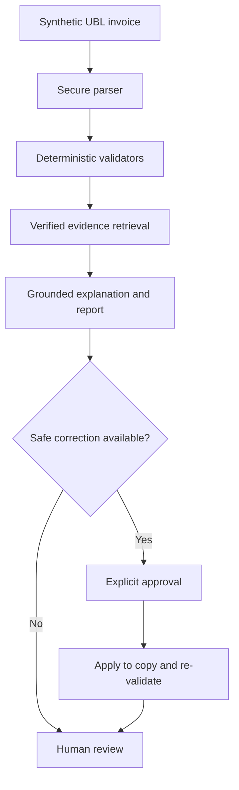

# ZATCA E-Invoicing Compliance Agent

An evidence-grounded, agentic AI proof of concept for pre-submission checks on **synthetic Saudi UBL 2.1 tax invoices**.

> **Project status:** Complete portfolio POC covering eight verified checks, a traceable ZATCA knowledge base, deterministic validation, conservative correction, sealed evaluation, and a Streamlit demo.

## Problem

Electronic invoices can fail because of missing data, invalid identifiers, XML structure errors, or inconsistent VAT and invoice totals. Diagnosing those failures is difficult when validation output is separated from the official requirement that explains it.

This project demonstrates a bounded pre-submission assistant that:

1. parses a synthetic UBL 2.1 invoice;
2. runs deterministic checks instead of asking an LLM to calculate tax or validate XML;
3. retrieves the verified ZATCA evidence associated with each finding;
4. explains the issue and proposes a correction only when the change is deterministic and safe;
5. applies approved changes to a copy, re-validates it, and generates a compliance report.

The system does not submit invoices to ZATCA and is not an official compliance, certification, legal, or tax service.

## Motivation

The engineering goal is not to produce a plausible chatbot answer. It is to make every important claim testable:

- active rules are traceable to official ZATCA publications;
- synthetic cases have deterministic ground truth and controlled error injection;
- calculations and XML checks are performed by code;
- explanations are bound to retrieved evidence;
- corrections require approval and are verified in a closed loop;
- the Final Test split is evaluated once and cryptographically sealed.

## MVP scope

The frozen profile is deliberately narrow:

| Dimension | Implemented profile |
| --- | --- |
| Document | UBL 2.1 `Invoice` XML |
| Invoice class | Standard Tax Invoice (B2B) |
| Type | `InvoiceTypeCode=388`, Saudi subtype `01`, base flags `0100000` |
| VAT | Domestic, standard-rated (`S`) only |
| Currency | SAR |
| Lines | Positive ordinary lines; no allowances or charges in generated fixtures |
| Data | Fully synthetic |
| Security lifecycle | Signing, stamping, clearance, reporting, and production APIs excluded |

### Selected checks

| Internal rule | Check | Official identifiers used |
| --- | --- | --- |
| `MVP-XML-001` | XML well-formedness and UBL 2.1 XSD validity | UBL 2.1 schema validation |
| `MVP-ID-001` | Invoice number presence | `BR-02`, `BT-1` |
| `MVP-DATE-001` | Issue-date presence, format, and temporal bound | `BR-03`, `BR-KSA-04`, `BR-KSA-F-01`, `BT-2` |
| `MVP-TYPE-001` | Frozen Tax Invoice type and subtype | `BR-04`, `BR-CL-01`, `BT-3`, `KSA-2` |
| `MVP-SELLER-001` | Seller name and VAT identifier | `BR-06`, `BT-27`, `BR-KSA-39`, `BR-KSA-40`, `BT-31` |
| `MVP-BUYER-001` | Buyer name presence | `BR-KSA-42`, `BT-44` |
| `MVP-LINE-001` | Line-net formula and line-sum reconciliation | `BR-KSA-EN16931-11`, `BR-CO-10`, related BTs |
| `MVP-VAT-TOTAL-001` | Standard VAT and document-total reconciliation | `BR-S-08`, `BR-S-09`, `BR-CO-13`–`BR-CO-17`, related BTs |

Severity values shown by the POC are internal triage levels, not official ZATCA severities. Other officially valid invoice profiles are reported as out of scope rather than incorrectly classified against this profile.

## Architecture



### Deterministic layer

- secure, namespace-aware XML parsing with `lxml`;
- UBL 2.1 XSD validation with a checksum-guarded local schema bundle;
- required-field, format, invoice-profile, seller, and buyer checks;
- `Decimal`-based line, VAT, and total reconciliation;
- deterministic correction eligibility, patching, original-integrity checks, and re-validation.

### Agentic layer

- chooses registered tools through a constrained orchestration workflow;
- retrieves evidence only from the verified rule corpus;
- constructs explanations from structured findings and evidence contracts;
- separates safe automatic proposals from human-required cases;
- records a tool trace and rejects unsupported rule claims.

The default path requires no LLM or API key. An optional OpenAI narrative adapter can rephrase already-grounded structured explanations, but it cannot change validation outcomes, evidence, severity, or correction eligibility. The sealed Final Test used no live LLM provider.

## Agent workflow

`parse_invoice` → select applicable checks → run deterministic tools → retrieve verified rule evidence → explain findings → propose safe correction → request approval → apply to a copy → re-validate → generate report

The report includes the invoice identifier, checks performed, passed checks, detected issues, severity authority, official references, suggested action, correction disposition, re-validation outcome, limitations, and disclaimer.

## Traceable knowledge base

The knowledge base stores, for each active rule:

- internal and official identifiers;
- exact meaning and applicability;
- deterministic validation logic;
- explicit severity authority;
- source document, section, pages, URL, and source date/version;
- valid and invalid examples;
- verification status.

Only records marked `VERIFIED` enter retrieval, evaluation, or a compliance decision. Deferred or unsupported ideas stay in `kb/rules/unverified_and_deferred.yaml`.

### Official sources

- [ZATCA E-Invoice Specifications](https://zatca.gov.sa/en/E-Invoicing/SystemsDevelopers/Pages/E-Invoice-specifications.aspx)
- [Electronic Invoice XML Implementation Standard, version 1.2](https://zatca.gov.sa/ar/E-Invoicing/SystemsDevelopers/Documents/20230519_ZATCA_Electronic_Invoice_XML_Implementation_Standard_%20vF.pdf)
- [Electronic Invoice Data Dictionary, 19 May 2023](https://zatca.gov.sa/ar/E-Invoicing/SystemsDevelopers/Documents/20230519_EInvoice_Data_Dictionary%20vF.xlsx)
- [E-Invoicing Implementation Resolution](https://zatca.gov.sa/en/E-Invoicing/Introduction/LawsAndRegulations/Documents/E-Invoicing%20Implementation%20Resolution_EN.pdf)
- [ZATCA Compliance and Enablement Toolbox](https://zatca.gov.sa/en/E-Invoicing/SystemsDevelopers/ComplianceEnablementToolbox/Pages/DownloadSDK.aspx)

The verification date and source roles are recorded in [`kb/sources/source_registry.md`](kb/sources/source_registry.md). The retained UBL 2.1 XSD subset comes from the [OASIS UBL 2.1 package](https://docs.oasis-open.org/ubl/os-UBL-2.1/UBL-2.1.zip); checksums and limitations are recorded in [`resources/ubl21/README.md`](resources/ubl21/README.md).

## Synthetic dataset methodology

The dataset is generated with Python using fixed seeds and deterministic mutation operators. Invoice XML, metadata, labels, and injection records are stored separately so the agent receives only the invoice and validation date during evaluation.

| Split | Cases | Intended use |
| --- | ---: | --- |
| Development | 48 | implementation and debugging |
| Validation | 32 | pre-final evaluation and controlled refinement |
| Final Test | 32 | one-time unseen evaluation |

Each generated case records the targeted rule, expected validity, injected error, expected value, and ground truth. Filenames and invoice content do not reveal labels. Dataset manifests and a Final Test seal make accidental changes detectable.

## Validation approach

- XML parsing is isolated from business-rule validation.
- Missing prerequisites stop dependent arithmetic checks instead of fabricating values.
- Monetary arithmetic uses `Decimal`; category VAT uses two-decimal `ROUND_HALF_UP` under the frozen profile.
- Retrieval is keyed to verified internal rules and returns exact source references.
- A correction is eligible only when its replacement value is derivable from existing invoice data and its evidence is verified.
- Approved changes are written to a new file; the original SHA-256 is checked before and after.
- Re-validation reports resolved, remaining, and introduced rules.

## Evaluation

Development and Validation can be evaluated repeatedly. Final Test is guarded by a dedicated single-use runner that freezes code and data hashes before inference, withholds ground truth until all predictions finish, then seals the outputs. Post-test tuning is prohibited.

### Final unseen results

| Metric | Result |
| --- | ---: |
| Final Test cases | 32 |
| Rule-level TP / FP / FN | 52 / 0 / 0 |
| Detection precision / recall / F1 | 1.0000 / 1.0000 / 1.0000 |
| Exact rule-set accuracy | 1.0000 |
| Rule retrieval accuracy | 1.0000 |
| Structural grounding rate | 1.0000 |
| Unsupported claims | 0 |
| Approved correction success | 7 / 7 |
| Re-validation pass rate | 1.0000 |
| Original integrity rate | 1.0000 |
| Tool-selection success | 32 / 32 |
| Invalid or failed tool calls | 0 / 138 |

Compliance confusion matrix, per-rule metrics, hashes, and the known presentation-only defect in the sealed Markdown renderer are documented in [`docs/phase_13_final_unseen_evaluation.md`](docs/phase_13_final_unseen_evaluation.md).

These perfect results establish consistency only within the declared synthetic benchmark. Final Test was unseen during development but shares the frozen schema, rule definitions, and mutation family with the other splits; the score is not evidence of complete production-invoice coverage.

## Demo

### Local installation

```bash
python3 -m venv .venv
source .venv/bin/activate
python3 -m pip install --upgrade pip
python3 -m pip install -r requirements.txt
```

### Streamlit application

```bash
python3 -m streamlit run app/streamlit_app.py
```

Upload one of the XML files under `data/synthetic/v1/development/invoices/`, confirm that it is synthetic, and select **Analyze invoice**. If a deterministic safe correction is available, inspect the patch and explicitly approve applying it to a copy.

### Command-line examples

```bash
# Run the eight deterministic checks
python3 scripts/run_validation.py \
  data/synthetic/v1/development/invoices/invoice_0001.xml \
  --validation-date 2026-09-05

# Run orchestration, evidence retrieval, explanation, and proposals
python3 scripts/run_agent.py \
  data/synthetic/v1/development/invoices/invoice_0001.xml \
  --validation-date 2026-09-05

# Query verified evidence without validating an invoice
python3 scripts/query_kb.py --rule-id MVP-VAT-TOTAL-001

# Evaluate only Development and Validation; this command cannot open Final Test
python3 scripts/run_evaluation.py
```

To use the optional narrative adapter:

```bash
python3 -m pip install -r requirements-llm.txt
export OPENAI_API_KEY="your-key"
python3 scripts/run_agent.py path/to/synthetic.xml \
  --validation-date 2026-09-05 --llm --model YOUR_MODEL --language ar
```

Do not commit `.env`, API keys, real invoices, or customer data.

## Testing

```bash
python3 -m unittest discover -s tests -q
python3 -m compileall -q app src scripts tests evaluation
```

The completed local suite contains **140 tests**. GitHub Actions repeats the test and compilation checks on pushes and pull requests.

## Repository structure

```text
app/                  Streamlit UI and upload boundary
src/agent/            Orchestration and grounded explanation
src/validators/       Deterministic validation engine
src/corrections/      Approval-gated copy-only corrections
src/rag/              Verified evidence retrieval
src/reporting/        JSON and Markdown reports
src/models/           Canonical invoice model and field mapping
data/synthetic/       Synthetic invoice XML and injection metadata
data/ground_truth/    Labels kept separate from invoice inputs
kb/                   Verified rules, source registry, and retrieval index
evaluation/           Metrics, guarded runners, and sealed results
resources/ubl21/      Checksum-recorded UBL 2.1 XSD subset
scripts/              Reproducible command-line entry points
tests/                Unit, integration, safety, and UI tests
docs/                 Phase decisions and implementation records
```

## Limitations

- Only eight selected checks and one Standard Tax Invoice profile are implemented.
- Simplified invoices, credit/debit notes, allowances, charges, prepayments, multi-category VAT, exports, exemptions, and special transaction flags are outside the benchmark.
- QR payloads, cryptographic stamps, signatures, certificates, invoice hashes, counters, and previous-invoice hashes are intentionally excluded.
- The project does not call ZATCA clearance/reporting APIs and does not replace the official SDK.
- All data are synthetic; behavior on arbitrary production documents has not been established.
- Grounding evaluation checks an exact structural evidence contract; it is not a substitute for independent legal or semantic review.
- The optional LLM adapter affects wording only and may still require human review.

## Future work

- compare selected findings with reproducibly packaged official SDK output;
- add separately verified Simplified Tax Invoice and note profiles;
- evaluate out-of-distribution mutation families and independently authored fixtures;
- introduce human grading for explanation faithfulness and usefulness;
- add the security/QR profile only after implementing its official cryptographic prerequisites;
- deploy the synthetic-only demo in a controlled portfolio environment.

## License

Project code is released under the [`MIT License`](LICENSE). The retained UBL 2.1 schema files preserve their embedded OASIS copyright and permission notices; their provenance and checksums are documented separately in [`resources/ubl21/README.md`](resources/ubl21/README.md).

## Disclaimer

This repository is an independent educational and portfolio proof of concept. It is not affiliated with, endorsed by, or certified by ZATCA. It does not provide legal or tax advice, process real customer invoices, submit documents to ZATCA, or guarantee regulatory compliance.

The strongest permitted conclusion is:

> **Passed the selected checks implemented in this proof of concept.**
