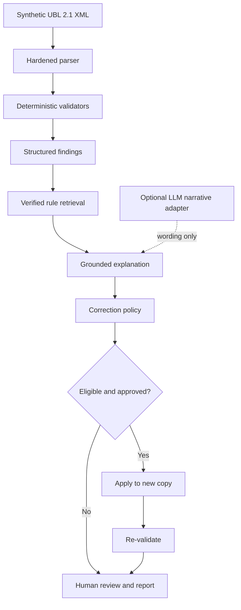

# ZATCA E-Invoicing Compliance Agent

[](https://github.com/Maram1alzahrani/zatca-compliance-agent/actions/workflows/tests.yml)
[](https://www.python.org/)
[](LICENSE)

A bounded, evidence-grounded AI workflow for pre-submission checks on synthetic Saudi UBL 2.1 Standard Tax Invoices.

The system parses invoice XML, runs eight deterministic checks, retrieves the verified ZATCA evidence behind each finding, produces a grounded explanation, proposes only derivable monetary corrections, requires human approval, applies approved changes to a copy, and re-validates the result.

> Portfolio and educational proof of concept. It does not submit invoices to ZATCA, replace the official SDK, process production data, or establish full regulatory compliance.

## Project at a glance

| Area | Implemented evidence |
| --- | --- |
| Validation | Eight deterministic XML, identity, date, profile, party, line, VAT, and total check groups |
| Grounding | Verified rule corpus with official identifiers, source sections, pages, URLs, and integrity checks |
| Agent workflow | Auditable state machine with registered tools, bounded inputs, structured outputs, and a sanitized tool trace |
| LLM boundary | Optional OpenAI adapter rephrases two narrative fields only; it cannot change findings, citations, severity, or correction eligibility |
| Safety | Human approval, source SHA-256 binding, copy-only writes, atomic output, target-value checks, and re-validation |
| Evaluation | 112 synthetic cases across Development, Validation, and a sealed 32-case Final Test |
| Quality | 140 automated tests and Python compilation checks in GitHub Actions |

## What the system actually does

1. Accepts a synthetic UBL 2.1 `Invoice` XML file.
2. Parses it with external entity resolution, DTD loading, network access, and huge-tree parsing disabled.
3. Validates UBL XSD structure and the eight selected business-rule groups in Python.
4. Retrieves the matching verified evidence record for every failed internal rule.
5. Builds explanations from validator findings and retrieved evidence.
6. Creates a correction proposal only for deterministic derived monetary values.
7. Waits for explicit approval before writing a corrected copy.
8. Re-runs the same validators and reports resolved, remaining, and introduced failures.
9. Produces JSON and Markdown reports plus an auditable tool trace.

The default path is fully local and requires no API key. The optional LLM adapter changes wording only; the sealed Final Test used no live LLM provider.

## Why this is an AI Engineering project

The core engineering problem is controlled AI behavior around high-stakes structured data, not free-form chatbot generation.

| Engineering concern | Repository implementation |
| --- | --- |
| Reliable tool use | Mandatory tool order is enforced by a deterministic workflow rather than delegated to unconstrained model planning |
| Grounded generation | Explanations are assembled from structured findings and a verified evidence contract |
| Hallucination containment | Generated rule IDs, URLs, unsupported claims, and prohibited compliance language are rejected; deterministic fallback remains available |
| Reproducibility | Fixed synthetic-data generation, separated labels, frozen evaluation inputs, and SHA-256 seals |
| Human oversight | Corrections require explicit approval and are never applied to the source file |
| Observability | Every tool call records sequence, sanitized input/output summaries, status, and error type |
| Graceful degradation | Validation, retrieval, correction policy, and reporting work without an LLM provider |

This is intentionally a bounded workflow agent, not a claim of autonomous compliance decision-making. See [System Architecture](docs/system_architecture.md) for the component boundaries and failure behavior.

## Architecture



### Responsibility boundary

| Deterministic code controls | Optional LLM may do | The system never does |
| --- | --- | --- |
| XML parsing and XSD validation | Rephrase `issue` and `why_flagged` in Arabic or English | Invent rules, citations, URLs, or missing invoice data |
| VAT, line, and total calculations | Return strict structured narrative output | Calculate tax, validate XML, or decide compliance |
| Rule selection and evidence retrieval | Fall back safely if output violates the contract | Submit, clear, report, sign, stamp, or certify invoices |
| Severity, correction eligibility, approval, and re-validation | — | Overwrite the original invoice |

### Retrieval design

The corpus contains eight rule-level chunks, and validators already return the corresponding internal rule ID. The primary path therefore uses exact rule lookup rather than semantic similarity. A BM25-style Arabic/English lexical search is available for exploratory queries. Corpus hashes, allowed status, chunk identity, rule completeness, and ZATCA-hosted source URLs are checked before retrieval is enabled.

## Implemented scope

The profile is deliberately narrow so every result remains testable.

| Dimension | Implemented profile |
| --- | --- |
| Document | UBL 2.1 `Invoice` XML |
| Invoice class | Standard Tax Invoice (B2B) |
| Type | `InvoiceTypeCode=388`, Saudi subtype `01`, base flags `0100000` |
| VAT | Domestic, standard-rated (`S`) only |
| Currency | SAR |
| Lines | Positive ordinary lines; no allowances or charges in generated fixtures |
| Data | Fully synthetic |
| Security lifecycle | Signing, stamping, clearance, reporting, and production APIs excluded |

### Selected checks

| Internal rule | Implemented check | Official identifiers used |
| --- | --- | --- |
| `MVP-XML-001` | XML well-formedness and UBL 2.1 XSD validity | UBL 2.1 schema validation |
| `MVP-ID-001` | Invoice number presence | `BR-02`, `BT-1` |
| `MVP-DATE-001` | Issue-date presence, format, and temporal bound | `BR-03`, `BR-KSA-04`, `BR-KSA-F-01`, `BT-2` |
| `MVP-TYPE-001` | Frozen Tax Invoice type and subtype | `BR-04`, `BR-CL-01`, `BT-3`, `KSA-2` |
| `MVP-SELLER-001` | Seller name and VAT identifier | `BR-06`, `BT-27`, `BR-KSA-39`, `BR-KSA-40`, `BT-31` |
| `MVP-BUYER-001` | Buyer name presence | `BR-KSA-42`, `BT-44` |
| `MVP-LINE-001` | Line-net formula and line-sum reconciliation | `BR-KSA-EN16931-11`, `BR-CO-10`, related BTs |
| `MVP-VAT-TOTAL-001` | Standard VAT and document-total reconciliation | `BR-S-08`, `BR-S-09`, `BR-CO-13`–`BR-CO-17`, related BTs |

Severity values are internal triage levels, not official ZATCA severities. Valid profiles outside this frozen scope are reported as out of scope rather than assessed as fully compliant or non-compliant.

## Verifiable evidence

The following claims can be inspected directly in the repository:

| Claim | Evidence |
| --- | --- |
| Validator behavior | [`src/validators/checks.py`](src/validators/checks.py) |
| Parser hardening | [`src/parsers/ubl_invoice.py`](src/parsers/ubl_invoice.py) |
| Agent workflow and approval gate | [`src/agent/orchestrator.py`](src/agent/orchestrator.py) |
| Optional LLM constraints | [`src/agent/openai_provider.py`](src/agent/openai_provider.py) and [`src/agent/explainers.py`](src/agent/explainers.py) |
| Verified retrieval policy | [`src/rag/retriever.py`](src/rag/retriever.py) and [`kb/rules/verified_mvp_rules.yaml`](kb/rules/verified_mvp_rules.yaml) |
| Correction safety | [`src/corrections/engine.py`](src/corrections/engine.py) |
| Final metrics | [`evaluation/results/phase_13_final_test.json`](evaluation/results/phase_13_final_test.json) |
| Result integrity | [`evaluation/results/phase_13_result_seal.json`](evaluation/results/phase_13_result_seal.json) |
| CI execution | [GitHub Actions test workflow](https://github.com/Maram1alzahrani/zatca-compliance-agent/actions/workflows/tests.yml) |

### Final unseen evaluation

The Final Test runner was executed once on 32 synthetic invoices. It froze code and data hashes before inference, withheld ground truth until all predictions completed, and sealed the outputs afterward.

| Metric | Result |
| --- | ---: |
| Rule-level TP / FP / FN | 52 / 0 / 0 |
| Detection precision / recall / F1 | 1.0000 / 1.0000 / 1.0000 |
| Exact rule-set accuracy | 1.0000 |
| Rule retrieval accuracy | 1.0000 |
| Structurally grounded findings | 52 / 52 |
| Unsupported claims | 0 |
| Approved correction success | 7 / 7 |
| Original integrity rate | 1.0000 |
| Tool-selection workflow success | 32 / 32 |
| Invalid or failed tool calls | 0 / 138 |

These perfect results establish consistency only within the declared synthetic benchmark. The Final Test was unseen during development but was generated from the same frozen schema, rule definitions, and mutation family as the other splits. The evaluation does not demonstrate robustness to independently authored production invoices, complete ZATCA coverage, or live-LLM reliability. Grounding was checked structurally, not by human semantic adjudication.

Full protocol, per-rule results, confusion matrix, hashes, and the preserved presentation-only reporting defect are documented in [`docs/phase_13_final_unseen_evaluation.md`](docs/phase_13_final_unseen_evaluation.md).

## Run the demo

### Install

```bash
python3 -m venv .venv
source .venv/bin/activate
python3 -m pip install --upgrade pip
python3 -m pip install -r requirements.txt
```

### Streamlit application

```bash
python3 -m streamlit run app/streamlit_app.py
```

Upload an XML file from `data/synthetic/v1/development/invoices/`, confirm that it contains synthetic data, and select **Analyze invoice**. The UI displays check results, evidence-backed findings, correction disposition, the tool trace, and downloadable JSON/Markdown reports. Eligible corrections remain disabled until explicit approval and are written only to a downloadable copy.

### Command-line examples

```bash
# Run the eight deterministic checks
python3 scripts/run_validation.py \
  data/synthetic/v1/development/invoices/invoice_0001.xml \
  --validation-date 2026-09-05

# Run validation, retrieval, explanation, and correction proposal
python3 scripts/run_agent.py \
  data/synthetic/v1/development/invoices/invoice_0001.xml \
  --validation-date 2026-09-05

# Query verified evidence
python3 scripts/query_kb.py --rule-id MVP-VAT-TOTAL-001

# Evaluate Development and Validation only; Final Test remains sealed
python3 scripts/run_evaluation.py
```

Optional LLM narrative adapter:

```bash
python3 -m pip install -r requirements-llm.txt
export OPENAI_API_KEY="your-key"
python3 scripts/run_agent.py path/to/synthetic.xml \
  --validation-date 2026-09-05 --llm --model YOUR_MODEL --language ar
```

Do not commit `.env`, API keys, real invoices, or customer data.

## Testing

```bash
python3 -m unittest discover -s tests -q
python3 -m compileall -q app src scripts tests evaluation
```

The latest committed GitHub Actions run completed 140 tests successfully and compiled the Python sources.

## Limitations and interpretation

| Limitation | Practical implication |
| --- | --- |
| Eight selected checks only | A pass means only that these implemented checks passed |
| One frozen B2B invoice profile | Simplified invoices, credit/debit notes, allowances, charges, prepayments, exports, exemptions, and multiple VAT categories are not evaluated |
| Security lifecycle excluded | QR payloads, signatures, certificates, cryptographic stamps, invoice hashes, counters, and previous-invoice hashes are not validated |
| No ZATCA integration | The system does not call clearance/reporting APIs and does not replace the official SDK |
| Synthetic data only | Behavior on real or independently authored production documents has not been established |
| Generated benchmark family | Perfect Final Test results do not measure out-of-distribution robustness |
| Structural grounding metric | Evidence fields are contract-checked, but explanation quality has not been independently graded by domain experts |
| No live LLM evaluation | The optional narrative adapter has contract and fallback tests, but no latency, cost, refusal, or language-quality benchmark |
| Narrow correction policy | Only existing, derivable monetary values can be changed; missing identity, date, profile, and XML information requires human review |

## Repository structure

```text
app/                  Streamlit UI and upload boundary
src/agent/            Workflow orchestration and grounded explanation
src/validators/       Deterministic validation engine
src/corrections/      Approval-gated copy-only corrections
src/rag/              Verified evidence retrieval
src/reporting/        JSON and Markdown reports
src/models/           Canonical invoice model and field mapping
data/synthetic/       Synthetic invoice XML and injection metadata
data/ground_truth/    Labels separated from invoice inputs
kb/                   Verified rules, source registry, and retrieval index
evaluation/           Metrics, guarded runners, and sealed results
resources/ubl21/      Checksum-recorded UBL 2.1 XSD subset
scripts/              Reproducible command-line entry points
tests/                Unit, integration, safety, evaluation, and UI tests
docs/                 Scope decisions, architecture, and implementation records
```

## Official source registry

The active rule records cite ZATCA-hosted sources with document title, version/date, section, pages, and URL. The registry is maintained in [`kb/sources/source_registry.md`](kb/sources/source_registry.md). The retained OASIS UBL 2.1 schema subset and its checksums are documented in [`resources/ubl21/README.md`](resources/ubl21/README.md).

## License and disclaimer

Project code is released under the [MIT License](LICENSE). Retained UBL schema files preserve their embedded OASIS notices.

This repository is an independent educational and portfolio proof of concept. It is not affiliated with, endorsed by, or certified by ZATCA. It does not provide legal or tax advice, process real customer invoices, submit documents to ZATCA, or guarantee regulatory compliance.

The strongest permitted conclusion is:

> Passed the selected checks implemented in this proof of concept.

