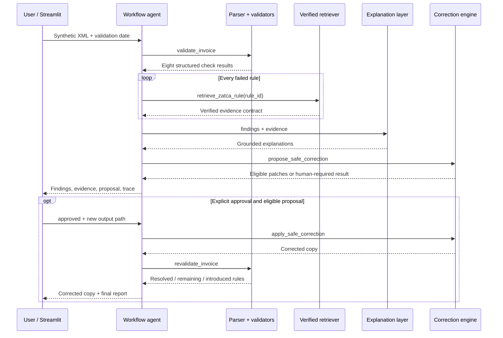

# System Architecture

This document explains the runtime path, trust boundaries, and failure behavior of the ZATCA E-Invoicing Compliance Agent. It describes only the implementation present in this repository.

## Design objective

The system keeps deterministic compliance checks separate from probabilistic language generation. XML validity, monetary calculations, evidence selection, severity, correction eligibility, approval, and re-validation remain controlled by code. An optional LLM can rephrase two already-grounded narrative fields but cannot change a decision.

## Runtime flow

## Component responsibilities

| Component | Input | Output | Trust boundary |
| --- | --- | --- | --- |
| Upload service | Filename, bytes, validation date | Temporary local XML path | Accepts `.xml` only, rejects empty or over-2 MB payloads, and never uses the uploaded name as a path |
| UBL parser | XML path | Canonical invoice plus parsed document | Disables entity resolution, DTD loading, network access, and huge-tree parsing; requires a UBL Invoice root |
| Validators | Canonical invoice, parsed XML, validation date | Eight `PASS`, `FAIL`, or `NOT_RUN` results | Uses XSD checks, Python rules, `Decimal`, and explicit prerequisite handling |
| Verified retriever | Internal rule ID or lexical query | Immutable evidence records | Rejects checksum mismatch, unverified rules, incomplete evidence, and non-ZATCA evidence URLs |
| Explanation service | Findings plus evidence | Grounded issue records | Source identifiers, URLs, applicability, meaning, and severity are copied from the KB, not generated |
| Optional OpenAI adapter | Bounded evidence payload | `rule_id`, `issue`, `why_flagged` | Strict structured output; invalid IDs, URLs, unsupported claims, or prohibited language trigger deterministic fallback |
| Correction engine | Invoice, findings, proposal policy | Patches or human-required disposition | Supports only existing deterministic monetary fields; binds proposals to source hash and current values |
| Reporting | Analysis and optional correction result | JSON and Markdown | Preserves limitations, conclusion boundary, evidence, and re-validation state |

## Bounded workflow agent

`ComplianceAgent` is a single workflow agent with deterministic mandatory tool selection:

1. `validate_invoice` runs exactly once.
2. `retrieve_zatca_rule` runs once for every failed rule.
3. `explain_issues` runs when failures exist.
4. `propose_safe_correction` evaluates the complete failure set.
5. `apply_safe_correction` and `revalidate_invoice` run only after eligibility and explicit approval.

This architecture does not claim open-ended autonomous planning or model-driven tool selection. The agent pattern is used to coordinate typed tools, preserve an execution trace, enforce approval, and contain optional generation.

## Deterministic validation layer

The validation layer covers the frozen Standard Tax Invoice profile and returns one result per selected rule group. It does not ask an LLM to interpret XML or calculate VAT.

- UBL 2.1 XSD validation uses a checksum-recorded local schema subset.
- Issue dates use an explicit evaluation date rather than an implicit runtime clock during formal evaluation.
- VAT identifiers and required party fields use fixed format and presence rules.
- Line, VAT, and total reconciliation use `Decimal` with two-decimal `ROUND_HALF_UP` behavior under the frozen profile.
- Missing prerequisites produce failure or `NOT_RUN` behavior rather than invented values.

## Evidence retrieval layer

The validator already knows which internal rule failed, so exact lookup is the primary retrieval path. This avoids semantic retrieval uncertainty for compliance findings. BM25-style Arabic/English lexical search is retained for exploratory queries.

Before serving evidence, the retriever verifies:

- corpus SHA-256 against the index;
- a retrieval-only policy allowing `VERIFIED` records only;
- rule count, chunk IDs, ordering, and alias coverage;
- official identifiers and precise source locations;
- HTTPS sources hosted by `zatca.gov.sa` or a subdomain.

An unknown rule returns no evidence. It does not trigger a fallback claim.

## Optional LLM boundary

The optional OpenAI adapter receives only the bounded grounding payload and returns a strict structured batch. It may write concise Arabic or English values for:

- `issue`;
- `why_flagged`.

It cannot author or alter:

- validation status;
- rule or source selection;
- official identifiers or URLs;
- applicability or severity;
- correction eligibility or patch values;
- approval or re-validation outcomes.

Provider errors or contract violations activate deterministic fallback. The default workflow and sealed Final Test use no live LLM provider.

## Correction safety model

Automatic proposals are limited to `MVP-LINE-001` and `MVP-VAT-TOTAL-001` when all required operands are complete and the invoice remains inside the frozen profile. Any unsupported failed rule blocks the whole automatic proposal.

The correction engine then enforces:

1. explicit approval;
2. a new, non-existing output path;
3. source SHA-256 equality with the approved proposal;
4. exactly one existing XML target per patch;
5. equality between the current XML value and the proposed old value;
6. atomic write to a copy;
7. original hash preservation;
8. re-validation with the same checks.

The engine does not insert missing nodes or infer invoice numbers, dates, parties, or legal document profiles.

## Observability and failure behavior

The tool registry records ordered events with tool name, status, sanitized input/output summaries, and error type. Raw XML and credentials are excluded from the trace.

| Failure | Behavior |
| --- | --- |
| Malformed or wrong-root XML | Parser returns a structured error; dependent checks do not fabricate invoice values |
| Missing or tampered KB artifact | Retrieval stops with `RetrievalError` |
| Unknown tool | Tool call is rejected and recorded as failed |
| Invalid LLM narrative | Deterministic explanation fallback |
| Unsupported or mixed correction case | Human review; no partial automatic correction |
| Changed source or XML target | Correction is rejected |
| Existing or source-equivalent output path | Correction is rejected |

## Evidence and evaluation

- Final Test input contract: invoice path and validation date only.
- Final Test size: 32 synthetic cases.
- Detected failed-rule instances: 52, with 52 TP, 0 FP, and 0 FN.
- Verified evidence retrieval: 52/52.
- Structurally grounded findings: 52/52, with zero unsupported claims under the automated contract.
- Approved correction trials: 7/7 successful, with complete original-file preservation.
- Workflow tool selection: 32/32 cases, 138 calls, zero failed or invalid calls.
- CI: 140 tests passed and Python sources compiled successfully in the committed GitHub Actions run.

These results measure consistency inside the repository's synthetic, same-family benchmark. They do not establish full ZATCA compliance, out-of-distribution robustness, production-invoice performance, human-rated explanation quality, or live-LLM reliability.

Primary evidence:

- [`../evaluation/results/phase_13_final_test.json`](../evaluation/results/phase_13_final_test.json)
- [`../evaluation/results/phase_13_result_seal.json`](../evaluation/results/phase_13_result_seal.json)
- [`phase_13_final_unseen_evaluation.md`](phase_13_final_unseen_evaluation.md)
- [`../src/agent/orchestrator.py`](../src/agent/orchestrator.py)
- [`../src/rag/retriever.py`](../src/rag/retriever.py)
- [`../src/corrections/engine.py`](../src/corrections/engine.py)

## Explicit exclusions

- Complete ZATCA rule coverage.
- Simplified invoices, credit/debit notes, allowances, charges, prepayments, multi-category VAT, exports, exemptions, and special transaction flags.
- QR payloads, signatures, certificates, cryptographic stamps, invoice hashes, counters, and previous-invoice hashes.
- ZATCA clearance/reporting APIs, production credentials, certification, or approval.
- Real customer data and production claims.

Permitted conclusion:

> Passed the selected checks implemented in this proof of concept.
